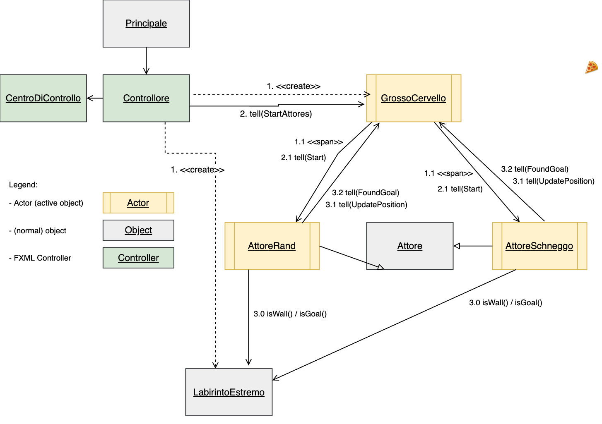

Dokumentation
===========
## Sequence Diagram

Ergänzend zum genauen beschrieb unter dem Punkt **Implementierung**.

* Schritt `1`: Der `Controllore` erstellt das `LabirintoEstremo` und das `GrossoCervello`
* Schritt `1.1`: Das `GrossoCervello` spawnt die beiden *Attores* `AttoreRand` und `AttoreSchneggo`
* Schritt `2`: Der `Controllore` startet das Game, indem dem `GrossoCervello` die Nachricht `tell(StartAttores)` geschickt wird
* Schritt `2.1`: Das `GrossoCervello` startet die beiden *Attores* mit der Nachricht `tell(Start)`
* Schritt `3.0`: Die beiden *Attores* starten ihre jeweillige Strategie und fragen bei jedem Zug das `LabirintoEstremo` über die Funktionen `isWall()` und `isGoal()` ab
* Schritt `3.1`: Nach jedem Zug schicken die beiden *Attores* eine Nachricht `tell(UpdatePosition)` an das `GrossoCervello`
* Schritt `3.2`: Falls es sich bei der neuen Position um das Ziel (Goal) handelt, wird eine Nachricht `tell(FoundGoal)` gesendet
## Einleitung
In diesem Projekt wird das Framework [`AKKA`](https://akka.io/) verwendet.  
Das Ziel war es eine einfache und kompakte Implementierung eines Labyrinths zu erstellen, in dem der mehrere Aktoren (*Attore's*) das Ziel finden müssen.
Schlussendlich soll der Ablauf dieses Prozesses noch grafisch dargestellt werden.

## Implementierung
Die Implementierung fand innerhalb von 2 Tagen statt und wird wie folgt dokumentiert:
### Backend
#### Labyrinth
Das Labyrinth ist ein einfaches, zufälliges, zweidimensionales Feld, in dem die Aktoren sich bewegen.  
An den X/Y Koordinaten können sich dann folgenden spezifischen Werte befinden:
- `0`: freies Feld
- `1`: Wand
- `2`: Pfad
- `13`: Ziel

Dieses wird am Anfang eines Spiels in der Klasse `Controllore` generiert. Die Längen der X und Y Koordinaten des Labyrinths werden durch die Variablen `LABIRINTO_X` und `LABIRINTO_Y` festgelegt.
Anschliessend wird das `Goal` zufällig auf ein Feld im Labyrinth gesetzt.
Danach werden die Anzahl zufällig generierter Mauern mit der Variable `LABIRINTO_WALLS` festgelegt und generiert (Natürlich so, dass das Goal nicht überschrieben wird).
In diesem Labyrinth werden die **Wände** als Wert `1` und **begehbare Punkte** als Wert `0` gespeichert.  
Das **Ziel** wird als Wert `-1` gespeichert.  
Folgende Funktionen werden vom Labyrinth präsentiert:
- `isWall(x, y)`: Gibt `true` zurück, wenn das Feld `(x, y)` eine Wand ist.
- `isGoal(x, y)`: Gibt `true` zurück, wenn das Feld `(x, y)` das Ziel ist.
- `îsPath(x, y)`: Gibt `true` zurück, wenn das Feld `(x, y)` ein bereits gegangener Pfad ist.
#### Aktoren
Es gibt diverse Aktoren, welche die einzelnen Aktionen ausführen:
- `GrossoCervello`: Dieser Aktor spawnt die anderen Aktoren und nimmt `onUpdatePosition()` und `onFoundGoal()` entgegen.
- `Attore`: Vererbt die folgenden Aktore:
  - `AttoreRand`:  
     Dieser Aktor bewegt sich zufällig und meldet dem *GrossoCervello*, wenn er sich bewegt oder ein Ziel gefunden hat. 
     Vor jedem Zug überprüft er, ob es sich beim neuen Feld um eine Wand handelt oder nicht. Der Zug wird nur ausgeführt wenn das Feld keine Wand ist.
  - `AttoreSchneggo`:  
     Im Gegensatz zum anderen Aktor hat dieser Aktor eine lokale Kopie eines leeren Spielfeldes (ohne Wände) und befüllt dieses mit bereits erforschten Pfäden.
     Vor jedem Zug wird das aktuelle Feld in der lokalen Kopie eingetragen und zusätzlich in einen Stack gepusht.
     Anschliessend versucht der Aktor sich möglichst immer nach rechts zu bewegen. Die zweite Priorität ist nach unten, die dritte Priorität nach links und die vierte Priorität noch oben.
     Es wird also der Reihe nach überprüft, ob sich in der jeweiligen Richtung eine Wand oder ein bereits begangener Pfad befindet.
     Wenn das nicht der Fall ist wird der Zug gemacht und anschliessend dem GrossoCervello Bescheid gegeben.
     Falls in keine der vier Richtungen ein Zug gemacht werden kann, geht der Aktor einen Schritt zurück. Dazu wird der vorherige Stand aus dem Stack gepoppt.

Die beiden Attore's kommunizieren jeden Schritt an das GrossoCervello mittels der `UpdatePosition` Message. Dies ist wichtig, damit das GrossoCervello dem Frontend per update Funktion die neuen Positionen übermitteln kann.
So wird das Frontend stets zu den neuen Schritten der Attores aktualisiert. Zudem teilen Sie dem GrosoCervello per `FoundGoal` Message die Position des Zieles mit, welches sie gefunden haben.
Doch beim `AttoreSchneggo` wurde zudem implementiert, dass falls der Stack empty ist, soll er die FoundGoal Koordinaten -1/-1 übermitteln.
Somit weiss dann das GrossoCervello, dass der `AttoreSchneggo` sein Ziel in seinem erreichbaren Bereich des Labyrinths nicht gefunden hat. 
Beim `AttoreRand` gibt es diese Funktion nicht, da dieser keinen State der gegangenen Pfade speichert und somit nicht erkennen kann, ob er in einem Bereich des Labyrinths eingesperrt ist oder nicht.

Generell überprüfen alle Attore's per Funktionsaufruf `isGoal()` in alle Richtungen +/- 1, ob sich da bereits das Goal neben ihnen befindet. 
Falls ja wird sofort dorthin gesprungen. Falls nicht, läuft der Attore je nach Strategie in aber sicherlich eine Richtung ohne Wand oder Pfad (Pfad nur bei AttoreSchneggo).

### Frontend
Das Frontend wurde mittels JavaFX realisiert. Die Main-Klasse `Principale` startet die erste Stage mit dem Haupt-Controller `Controllore`. Dieses Fenster beinhaltet das Labyrinth. Der Haupt-Controller startet anschliessend eine zweite Stage mit dem `CentroDiControllo`-Controller. Dieses Fenster beinhaltet zwei Buttons um das Game zu starten, stoppen oder erneut zu starten. Zudem werden die Resultate, falls ein *Attore* das Ziel erreicht auch dargestellt.

Das Labyrinth wurde mit einer `FXML Group` und anschliessenden `Rectangle`-Objekten realisiert. Für jedes Feld wurde somit ein Rechteck (Rectangle) erstellt und an seine entsprechende Position platziert. Wände werden schwarz, das Feld weiss und das Goal grün dargestellt. Die Akteure haben jeweils eigene Farben.

Bei jeder `tell(updatePosition)` Nachricht von den *Attore* an das `GrossoCervello` ruft dieser eine Update-Funktion im `Controllore` auf, welcher die *View* (die Darstellung des Labyrinth) aktualisiert.

## UML Diagramme
Folgende Klassendiagramme sind im `img`-Ordner verfügbar:

* [UML Klassendiagramm Übersicht](../img/uml_class_bigpicture.png)
* [UML Klassendiagramm Frontend](../img/uml_class_frontend.png)
* [UML Klassendiagramm Backend](../img/uml_class_backend.png)

## Conclusion
Wir haben in diesem Projekt die Anforderungen erreicht und konnten den Auftrag in der gewünschten Zeit erarbeiten.

Zu Beginn hatten wir einige Probleme festzulegen, welche Messages an welche Aktoren gesendet werden sollten und mussten einige Male unsere Planung anpassen. Als wir den richtigen Ansatz gefunden haben, konnten wir produktiv als Team arbeiten und sind gut vorwärts gekommen.

#### Verbesserungen
Aus zeitlichen Gründen hat unser Programm aktuell nur zwei Strategien. Es wäre interessant gewesen herauszufinden welche anderen Strategien es gibt und wie diese Effizient umgesetzt werden könnten. Zum Beispiel könnte es eine Aktorengruppe geben welche Informationen untereinander austauscht und so das Spielfeld schneller analysiert und dadurch schneller das Goal findet.

Falls Parameter (Spielfeldgrösse, Anzahl Mauern, Zugzeit) angepasst werden sollen muss das aktuell direkt im Code gemacht werden. Mit mehr Zeit, hätte man das direkt im Interface implementieren können.

#### Rückblick
Da wir als Team die Blockwoche 2020 bereits gemacht haben konnten wir dieses Jahr einen direkten Vergleich ziehen. Wir sind uns alle einig, dass wir seit letztem Jahr besser als Team arbeiten und effizienter Arbeiten können.
