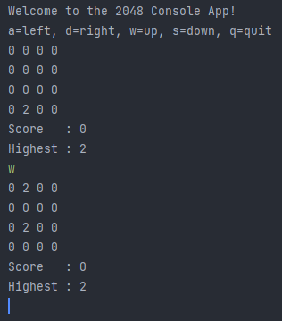
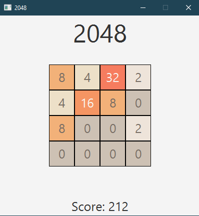
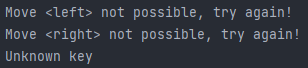

# **Bericht 2048 Game**
**Autor**: [@laubj5](https://https://gitlab.ti.bfh.ch/laubj5)  
**Projekt**: [2048 game](https://gitlab.ti.bfh.ch/hs2021_22/project-and-training-1/block-3/game2048-be-java-02)  
**Projektbeschreibung**:  
Das Spiel 2048 ist ein bekanntes Einzelspieler-Spiel, welches im Jahr 2014 von einem italienischen Entwickler für Mobile Devices veröffentlicht wurde.  
Ein Demo davon findet man auf folgender Website:
- [2048.ninja](https://2048.ninja)

## **Einleitung**
Das Ziel dieses Projektes ist es, das Spiel **2048** für die Konsolenein- und -ausgabe zu realisieren.
Es soll auch für JavaFX Gui implementiert werden.
Das Spiel basiert darauf, einzelne Zellen (n x n) mit Zahlen der Potenz 2 zu verschieben und beim Verschieben den vorherigen Wert zu einer Punktzahl zu addieren.
Das Ziel des Spiels ist es also, die höchstmögliche Punktzahl zu erreichen.
Nach jedem Zug (in beliebiger Richtung) erscheint eine neue Zahl in einem unbesetzten Feld.
Das bedeutet, dass das Spiel zu Ende ist, sobald keine Zellen mehr zusammengelegt oder verschoben werden können.
Das Projekt wird mit Gitlab verwaltet und in diesem Markdown-Bericht dokumentiert und schliesslich als PDF eingereicht.
Für jede Arbeitseinheit wird ein Arbeitsjournal geführt.
Da ich allein bin, konnte ich meine Arbeit logischerweise nicht aufteilen.

## **Arbeitsjournal**
### **Montag 13.12.2021**
Heute begann ich die Arbeiten für das Projekt. Ich versuchte erst die Aufgabenstellung genauestens zu verstehen und hatte danach das erste Meeting mit **Rolf Hänni**. 
Er gab mir einige Tipps und Ideen für die weiteren Schritte: 
- Implementation des Algorithmus in der Grid Klasse
  - Dazu Gedanken machen, wie der Algorithmus für jede Richtung standardisiert werden kann.
- Bericht
  - Der Bericht soll das nötigste zum Projekt und deren Arbeit aufzeigen.

Somit begann ich mit der Implementierung des Algorithmus angefangen beim moveUp().
Tricky hierbei war es, das Nachschieben der 0 Stellen zu implementieren. 
Doch nach einigem Herumprobieren hatte ich den Algorithmus nun auch auf die angenommen korrekte Art implementiert. 
Jedoch war dies nicht der Fall, denn das Nachrückungsproblem bestand immer noch bei diversen Fällen.
Dieses wird jedoch in der nächsten Arbeitseinheit behoben.

### **Dienstag 14.12.2021**
An diesem Tag begann ich damit die vorherigen Schritte komplett zu überdenken und meine bisherige Implementierung zu verwerfen. 
Nach einer aufwändigen Recherche im Internet habe ich mir dann Gedanken dazu gemacht, wie ich die einzelnen Algorithmus-Schritte in einzelne Methoden ausbauen kann. 
Zudem kam mir die Idee der Implementation einer *Cell* Klasse, aus dieser ein zwei dimensionales Array für das Grid erstellt wird. 
Auch soll sie weitere Algorithmus-unterstützende Methoden anbieten. 
Somit implementierte ich die Klasse *Cell* mit folgenden Methoden:
- *Constuctor* ohne Parameter
- *Constructor* mit Parameter
- `getValue()`
- `setValue(int value)`
- `equals(Cell other)`
- `merge(Cell other)`
- `reset()`
- `toString()`

Anschliessend begann ich damit in der *Grid* Klasse die einzelnen Methoden des Algorithmus zu definieren: 
- `move(Direction direction)`
  - Hierbei ist das Enum Direction zu erwähnen, welches folgende Values besitzt:
    - *UP*
    - *DOWN*
    - *LEFT*
    - *RIGHT*
  - Diese Methode soll das Grid nach einer bestimmten Richtung durchlaufen und die Werte zusammenführen.
- `isEmptyCell(List<Cell> cellSet)`
  - Überprüft, ob die Liste nur leere Zellen enthält.
- `slide(List<Cell> cellSet)`
  - Verschiebt alle Zellen in eine Liste nach einer bestimmten Richtung und addiert anschiessend die Werte, wenn sie gleich sind.
  - Beinhaltet folgende zwei Methoden:
    - `slideToEdge(List<Cell> cellSet)`
      - Verschiebt alle Zellen an den Rand des Grids.
    - `mergeCell(List<Cell> cellSet)`
      - Addiert die Werte der Zellen, wenn sie gleich sind.
- `remainingIsZero(List<Cell> cellSet, int index)`
  - Überprüft, ob die übrigen Zellen der Liste den Wert 0 haben.
- `slideTo(List<Cell> cellSet, int index)`
  - Verschiebt alle Zellen an einen bestimmten Index.
- `isGameOver()`
  - Prüft zuerst per *hasEmptyCell()* ob es eine leere Zelle im gesamten Grid gibt. Falls ja ist noch nicht GameOver. Falls nein wird noch überprüft, ob es Zellen gibt, welche den gleichen Wert nebeneinander haben. Für diese beiden Prüfungen werden folgende Methoden verwendet:
    - `hasEmptyCell()`
      - Überprüft, ob es eine leere Zelle im gesamten Grid gibt.
    - `hasEqualNeighbour()`
      - Überprüft, ob es Zellen gibt, welche den gleichen Wert nebeneinander haben.
  
Anschliessend wurden den einzelnen Move Cases auf die vordefinierten Methoden der Klasse gelegt. 
Zudem wurde noch die *toString()* Methode implementiert, welche das Grid als String zurückgibt. 
Zum Ende des heutigen Tages funktioniert die Implementierung des Algorithmus. 
Alle Tests in *GridTest* sind erfolgreich.

#### **nächsten Schritte**
1. Implementierung einer Methode, welche eine random Zelle auswählt, die leer ist und mit einer 2er Potenz Zahl gefüllt wird.
2. Implementierung der Score und Highest Number Logik.
3. Implementierung der ConsoleApp Klasse mit interaktivem Spielablauf.

### **Montag 27.12.2021**
Als Erstes begann ich mit der Abarbeitung des 1. Schrittes. Ich habe die Methoden `getRandomCell()` und `setRandomCellValue()` implementiert. 
Diese werden in der Console App verwendet nach jedem Move einen neuen Zufallswert in einer leeren Zelle zu setzen. 
Beim Schritt 2 wurde in der Methode `mergeCell()` eine Logik implementiert, in der der höchste Wert und Score ermittelt und gesetzt wird. 
Auch wird der höchste Wert der Zelle anfänglich beim Spawnen einer Random Zahl in einer Zelle gesetzt. 
Abschliessend wurde noch der Schritt 3 implementiert. Hier wurde ebenfalls mit try / catch bei jedem move geprüft, ob dieser einen Error wirft. 
Denn anfänglich stürzte das Spiel beim Move in eine nicht mögliche Richtung ab. Auch wurde die GameOver Logik umgesetzt. 

Das Nächste auf der ToDo Liste ist die Umsetzung der JavaFX App. Hierbei musste ich anfänglich einige Recaps von JavaFX durchgehen. 
Mit dem nun erarbeiteten Wissen konnte ich anfangen das GUI zu erstellen. Die Szene besitzt ein root BorderPane. 
In dessen Mitte befindet sich ein GridPane. Hier werden die Zellen dargestellt. Wenn GameOver ist, wird ein Label angezeigt und das GridPane wird ausgeblendet. 
Zuoberst befindet sich ein Label, welches den Titel anzeigt. Zuunterst befindet sich ein Label, welches den Score anzeigt und updated.
Die wichtigste Funktion in dieser Klasse ist `updateGrid()`, welche die Zellen aktualisiert. 
Bei jedem Move wird das Grid mit dieser Methode aktualisiert.

#### **nächsten Schritte**
1. Minimale JavaDocs

### Donnerstag 30.12.2021
Heute wurde die JavaDocs zu jeder Funktion und Klasse erstellt. 
Anschliessend wurde der Code nochmals final getestet und auf clean Code umgestellt. 

#### **nächsten Schritte**
- *keine*

## Resultate
Da ich allein war und meine Arbeit nicht aufteilen konnte, musste ich doppelt so viel tun wie ein Team, das aus zwei Personen besteht (Verteilung der Aufgaben, insbesondere bei der Implementierung der Konsole und der JavaFX-App).
Ich habe also nur die grundlegenden Funktionen in beiden Versionen implementiert.
Nämlich das Spielen des Spiels bis zum Game Over. Um das Spiel neu zu starten, muss dann die Anwendung neu gestartet werden.
Kleinere Features wie eine Highscore-Tafel habe ich aus den oben genannten Gründen nicht implementiert.
Das Styling der JavaFX-Anwendung habe ich jedoch an die Originalfarben des Spiels angelehnt.

### **Console App**
 \
Gespielt wird die `Console App` mittels folgenden Tasten:
- `w` (up)
- `s` (down)
- `a` (left)
- `d` (right)

Nach jeder Eingabe muss zusätzlich die `Enter` Taste gedrückt werden.
Es ist zudem möglich das Spiel mit der Eingabe von `q` zu beenden.
Im Console Output sieht man immer das Erzeugte Grid, Score und Highest Number.

### **JavaFX App**
 \
Und die `JavaFX App` wird mit folgenden Tasten gespielt (selbsterklärend):
- `arrow up`
- `arrow down`
- `arrow left`
- `arrow right`

Der Score wird nach jedem Betätigen der oben erwähnten Tasten aktualisiert und unter dem Grid angezeigt.
Falls ein Move nicht möglich sein sollte, wird dies in der Konsole ausgegeben: \

## **Diskussion und Schlussfolgerungen**
Das Spiel funktioniert wie vorgesehen. Was allerdings noch ein kleiner Fehler ist, ist, dass es vorkommen kann, dass neue Zahlen in leeren Feldern auftauchen, nachdem ein nicht möglicher Zug ausgeführt worden ist.
Da die Spielmechanik dadurch aber nicht verloren geht, wird dies nun als Feature behandelt.
Das Spiel könnte aber noch auf verschiedene Weise erweitert werden. Im Folgenden einige Beispiele:
- Erste Eingaben zur Grösse des Spielfeldes
- HighScore
- Multimandantenfähigkeit (Abfrage des Spielernamens nach GameOver)
- Tutorial für FX-Version
- Möglichkeit, das Spiel direkt neu zu starten
- usw...

Für mich persönlich war die Implementierung des Spielalgorithmus die schwierigste Arbeit und hätte unmöglich auf ein Team aufgeteilt werden können.
Die Entwicklung der einzelnen Spiele-Frontends hätte man aber sehr wohl parallel aufteilen können.
So hätte das, woran ich alleine in X Stunden gearbeitet habe, in X/2 erledigt werden können und die anderen X/2 hätten für die Implementierung der oben genannten Features verwendet werden können.
Wie auch immer, ich bin mit meiner Arbeit sehr zufrieden, aber ich hätte mich über einen Teamkollegen gefreut.