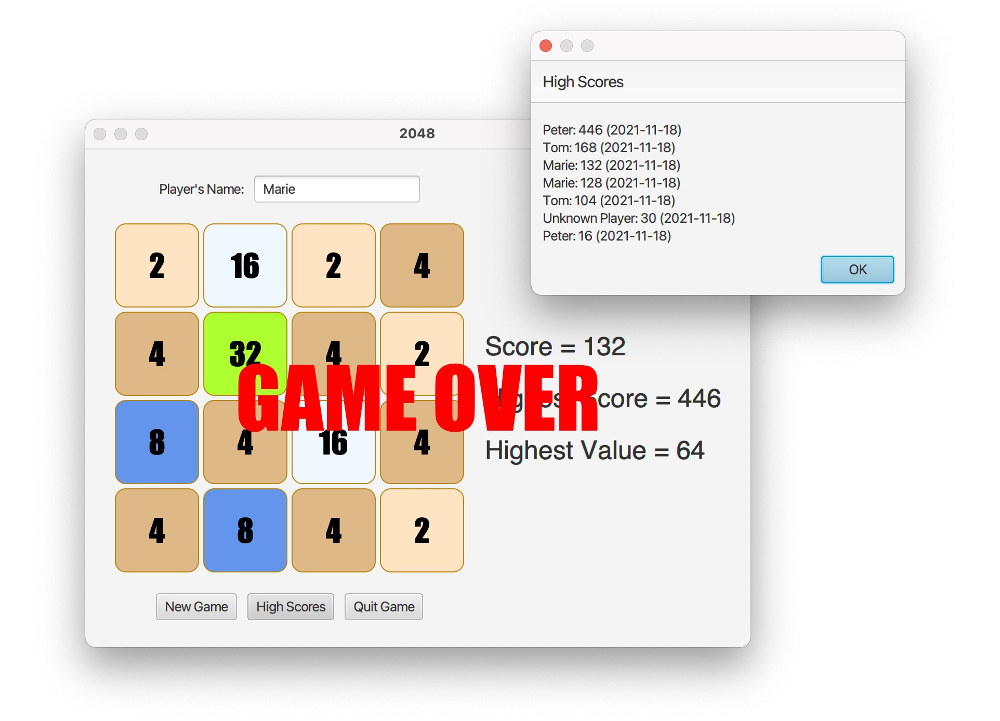

# Project & Training (Block 3)


## Introduction

The goal of this Block 3 project is to develop a Java program to play the 2048 game. 2048 is a single-player video game released in 2014 for mobile devices by an Italian developer. To learn the concept and logic of the game, you can play it online for example at https://2048.ninja.

Your implementation must consist of both a console app and a JavaFx app. Here are corresponding screenshots of how your solution could look like:

#### Console App

The game board starts with two initial values selected and placed at random with P(value=2)=0.9 and P(value=4)=0.1. After each move, a new random value is added to the grid.

```
WELCOME TO 2048
a=Left, s=Right, w=Up, y=Down, q=Quit
0 0 0 0
0 4 0 0
0 2 0 0
0 0 0 0
Score  : 0
Highest: 4
s
0 0 0 0
0 0 2 4
0 0 0 2
0 0 0 0
Score  : 0
Highest: 4
y
0 0 0 0
0 0 0 0
0 0 0 4
2 0 2 2
Score  : 0
Highest: 4
s
0 0 0 0
0 0 0 0
0 4 0 4
0 0 2 4
Score  : 2
Highest: 4
s
0 0 0 2
0 0 0 0
0 0 0 8
0 0 2 4
Score  : 6
Highest: 8
a
2 0 0 0
0 0 0 0
8 0 0 2
2 4 0 0
Score  : 6
Highest: 8
w
2 4 0 2
8 0 0 0
2 0 0 0
0 0 0 2
Score  : 6
Highest: 8
w
2 4 0 4
8 0 0 2
2 0 0 0
0 0 0 0
Score  : 8
Highest: 8
q
2 4 0 4
8 0 0 2
2 0 0 0
0 0 0 0
Score  : 8
Highest: 8
GAME QUIT!
```

#### JavFx App



## Tasks

* Create a class diagram that models the data and logic of the game. In the center of that diagram must be a class called <code>Grid</code> that represents the 2-dimensional grid of cells of the 2048 game. Make sure that that the class supports grids with different widths and heights (4x4 is the default). For this, write a constructor with two integer arguments <code>width</code> and <code>height</code>.

* Implement and test the game logic. The class must pass all given JUnit tests from the file <code>GridTest</code>. For executing the tests, your class must provide the following methods (their respective meanings follow from the names):

  - <code>int getValue(int x, int y, int value)</code>
  - <code>void setValue(int x, int y, int value)</code>
  - <code>void moveUp()</code>
  - <code>void moveDown()</code>
  - <code>void moveLeft()</code>
  - <code>void moveRight()</code>
  - <code>boolean gameOver()</code>

  A template for this class with corresponding method stubs is given.
* Implement the 2048 game as a console app similar to the example given above.
* Implement a JavaFx user interface that visualizes the game, displays the
  scores and allows the player to to play the game using the arrow keys. You are free to choose any design you want (shapes, colors, fonts, ...). Animations are not required.
  *Hint: Call the method <code>scene.addEventFilter(KeyEvent.KEY_PRESSED, eventHandler)</code> to install an event handler that listens for keys being pressed in the main scene. Otherwise, using <code>scene.onKeyPressed(eventHandler)</code>, some key events may be directed to other JavaFx controls.*

## Evaluation Criteria

These are the evaluation criteria:

* Correct implementation of the game logic (all provided test pass)
* A running console application
* A running JavaFX application

To pass, all three criteria above must be fulfilled to a satisfactory degree.

We also expect you to submit clean code (no warnings, no unused code, no TODO's), to strictly apply naming conventions, to declare variables and methods properly as private/public/protected, and to include a minimal amount of JavaDoc.

## Importing the Project into Eclipse or IntelliJ

To import the project from the Git repository into Eclipse, select <code>File -> Import... -> Git -> Projects from Git (with smart import) -> Clone URI</code>. In IntelliJ, select <code>File -> New -> Project from version control -> Git -> clone</code>. In both cases, copy/paste the repository URL from the GitLab web page.

The given repository contains a Maven project for JavaSE 17, which defines the necessary dependencies to JavaFx and JUnit. By importing the project into your IDE, the dependencies should be resolved automatically.

The repository contains a sample JavaFx application and a sample JUnit test file. Verify that both the sample JavaFx app and the sample JUnit test file are working on your machine.

## Maven

To execute the console application <code>ch.bfh.bti3001.apps.ConsoleApp</code> with Maven, type:

> `mvn clean compile exec:java`

To execute the JavaFX application <code>ch.bfh.bti3001.apps.JavaFxApp</code> with Maven, type:

> `mvn clean compile javafx:run`
