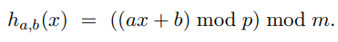
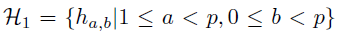
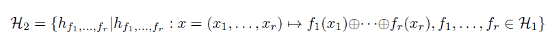

# Answers to Exercise 10

## Task a)
In der Dokumentation unter https://docs.oracle.com/javase/7/docs/api/ findet man zu java.lang.String folgende Berechung der Methode **hashCode()**:  

`s[0]*31^(n-1) + s[1]*31^(n-2) + ... + s[n-1]`  

Verwendet werden natürliche Zahlen.  
*Glossar:*
- **s[i]** ist der i-te Character des Strings
- **n** ist die länge des Strings
- **^** bedeutet das die folgenden Zeichen als Exponent gerechnet werden
Der Hashwert von einem leeren String ist 0.  

Dieses Polynom kann *effizient* per **Horner Schema** berechnet werden.

sources: 
- https://docs.oracle.com/javase/7/docs/api/
- https://www.geeksforgeeks.org/how-string-hashcode-value-is-calculated/

## Task b)
**Universal Hashing** beschreibt in der Informatik und Mathematik das zufällige Auswählen einer HashFunktion aus einer HashFunktions-Sammlung.  
Diese Sammlung beinhaltet eine definierte Menge *einfacher* Hashfunktionen.  
Das garantiert eine sehr geringe Wahrscheinlichkeit einer Kollision.  
Dazu wird dann eine Primzahl *p* gewählt, welche gleichgross oder grösser als die Anzahl Schlüssel und grösser als *m* ist.  
Zudem werden zwei Zahlen *a* und *b* zufällig im Bereich 1 <= *a* <= *p,0* <= *b* < *p* gewählt.  
Universal Hashing hat viele Anwendungsbereiche in der Informatik, z.B. bei der Implementation von Hash Tables, zufälliger Algorithmen und in der Kryptographie.

### universelle Hashfunktion
*Glossar:*  
**a** ∈ {1,2,...,p-1} # zufällig gewählte Zahl, so dass a != 0  
**b** ∈ {0,1,...,p-1} # zufällig gewählte Zahl  
**p** # Primzahl, welche im vorab so festgelegt wird, dass sie grösser als die Hashtabelle ist.
**m** # Anzahl hash functions im Funktionsset von der random ausgewählt wird  

*Funktion:*  


Dies sind die zugehörigen Klassen zur Carter & Wegman universellen Hashfunktion:  

#### 1st universal class
Setzt voraus, dass die Bitvektoren, die den Schlüssel repräsentieren, effizient multipliziert werden können:  


#### 2nd universal class
Falls die Schlüsselwerte zu lang sind empfehlen Carter und Wegman eine andere Klasse:  
  
Beschreibt die XOR Operation. Falls *r* eine Zweierpotenz ist, dann ist diese Klasse nahezu universell.  
Wenn nötig, kann der Schlüssel *x* mit Nullen aufgefüllt werden, um eine Zweierpotenz zu erhalten.

sources: 
- https://en.wikipedia.org/wiki/Universal_hashing
- https://www.youtube.com/watch?v=3cTTzYc3gnE
- https://www.cs.umd.edu/class/fall2019/cmsc420-0201/Lects/lect10-hash-basics.pdf
- Script *Algorithmen und Datenstrukturen* | Dr. Jürgen Eckerle

## Task c)
Da ich die Implementation von einer universal Hash Methode weitaus am kompliziertesten fande, habe ich dies auf 2 verschiedene Arten realisert.

### Implementation 1
**zusätzlich als code File mitgelifert `implementation.java`**  
Bei der 1. Implementation wird beim Erzeugen eines *UniversalHash* Objektes mit dem Integer *m* die Anzahl an hash Funktionen definiert, welche aus der universellen Hashfamilie erstellt werden (m wird automatisch zu einer Primzahl konventiert).  
Mit *p* kann man eine Primzahl definieren, welche gleich gross oder grösser als die Anzahl Schlüssel in der HashTable ist.  
Zu beachten gilt:  
Man kann die Werte *m* und *p* auch als 2er Potenz definieren: `(int) Math.pow(2, 23)` (hierbei ist 23 die Primzahl).  
Dies ist beim Wert *p* sinnvoll bis *2<sup>27</sup>*, danach überlappt der integer Wert und man sollte sich danach z.B. BigInt herbeiziehen.
Doch das hat zur Folge, dass die gesamte Implementation angepasst werden muss und es zu grösseren Leerwerten kommt.

*Features*  
Falls dieses UniversalHash Objekt in einer HashTable zum Einsatz kommt, kann mittels *defineHashFunction()* Methode im Falle einer Kollision eine neue Hashfunktion per Random faktor aus der Hashfunktionsliste definiert werden.
```java
import java.util.ArrayList;
import java.util.Random;
import java.util.concurrent.ThreadLocalRandom;

public class Main {
    public static void main(String[] args) {
        // String to hash
        String testString = "DiesIstEinTest";
        // Generate m hash functions out of the universal hash family
        int m = 5000;
        // Define a prime number, should be bigger than the count of keys in your HashTable
        int p = 1010111;

        UniversalHash universalHash1 = new UniversalHash(testString, m, 1010111);
        System.out.println();
        System.out.println("Universal Hash: " + universalHash1.hashCode());
        System.out.println("Universal Hash (same as above): " + universalHash1.hashCode());

        // You can call defineHashFunction again, if you got an collision in your HashTable
        universalHash1.defineHashFunction();
        System.out.println("New Hash Function selected: " + universalHash1.hashCode());
    }
}

interface hashFunction {
    int hashFunc(String s,int p,int m);
}

class UniversalHash {
    private ArrayList<hashFunction> hashFunctions = new ArrayList<>();
    private hashFunction hashF;
    private String string;
    // prime number of the next bit modulo calculation
    private int prime = 1;
    // next prime number of the size of the HashTable
    private int m;

    private int nextPrime(int num) {
        num++;
        for (int i = 2; i < num; i++) {
            if(num%i == 0) {
                num++;
                i=2;
            }
        }
        return num;
    }

    @Override
    public int hashCode() {
        return hashF.hashFunc(string, prime, m);
    }


    public void defineHashFunction() {
        Random rand = new Random();
        hashF = hashFunctions.get(rand.nextInt(hashFunctions.size()));
    }

    private int defineA(int prime) {
        return ThreadLocalRandom.current().nextInt(1, prime);
    }
    private int defineB(int prime) {
        return ThreadLocalRandom.current().nextInt(0, prime);
    }

    public UniversalHash(String string, int m) {

        this.string = string;

        this.m = m;

        int prime = 31;
        this.prime = prime;

        createHashFunctions(m, prime);

        defineHashFunction();
    }

    public UniversalHash(String string, int m, int p) {
        this.string = string;
        this.m = nextPrime(m);
        this.prime = p;

        createHashFunctions(m, p);

        defineHashFunction();
    }

    private void createHashFunctions(int m3, int prm) {
        for (int i = 0; i < m3; i++) {
            // create as much hashFunctions as defined in m
            int a = defineA(prm);
//            System.out.println("A["+i+"]: " + a);
            int b = defineB(prm);
//            System.out.println("B["+i+"]: " + b);
            hashFunction hashFunc = (String s, int p, int m2) -> {
                char[] chars = s.toCharArray();
                // Universal hash family of Carter and Wegman
                int hash = 0;
//                int counter = 0;
                for (char character : chars) {
                    hash += ((a*character + b) % p) % m2;
                    // For Debugging:
//                    System.out.println("Function ["+counter+"]: (("+a+"*"+character+" + "+b+") % "+p+") % "+m2);
//                    counter++;
                }

                return hash;
            };
            hashFunctions.add(hashFunc);
        }
    }

    public hashFunction getHashF() {
        return hashF;
    }

    public int getPrime() {
        return prime;
    }

    public int getM() {
        return m;
    }
}
```

### Implementation 2
**nicht als code File mitgelifert, sondern nur in diesem PDF sichtbar**  
Die 2. Implementation hat keine Hashfunktionsliste, sondern berechnet beim Erstellen des Objekts einfach 2 zufällige Zahlen für *a* und *b* im vorgegebenen Range der universellen Funktion.  
Somit werden nur diese zwei Variablen als State der Hashfunktion gespeichert und *m* wird eigentlich ein bisschen unnötig hierbei.
Wie gesagt, ist diese Implementation nur als *alternative* Implementation gedacht, welche die universelle Hashfunktion mit einer geringerer Laufzeit und Speicherbeanspruchung realisiert.

```java
import java.util.concurrent.ThreadLocalRandom;

public class Main {
    public static void main(String[] args) {
        String testString = "DiesIstEinTest";
        int m = 555555;
        int prime = 600011;

        UniversalHash universalHash = new UniversalHash(testString, m, prime);
        System.out.println("Prime Number: " + universalHash.getPrime());
        System.out.println("A: " + universalHash.getA());
        System.out.println("B: " + universalHash.getB());
        System.out.println("M: " + universalHash.getM());
        System.out.println("Universal hashCode Class 1: " + universalHash.hashCode());
        System.out.println("Normal hashCode: "+ testString.hashCode());
    }
}

interface hashFunctionFamily {
    int hashCode();
}

class UniversalHash implements hashFunctionFamily {

    private final String string;
    // prime number of the next bit modulo calculation
    private final int prime;
    private int a;
    private int b;
    // next prime number of the size of the HashTable
    private int m;

    private int nextPrime(int num) {
        num++;
        for (int i = 2; i < num; i++) {
            if(num%i == 0) {
                num++;
                i=2;
            }
        }
        return num;
    }

    @Override
    public int hashCode() {
        // Universal hash family of Carter and Wegman
        char[] chars = string.toCharArray();
        int hash = 0;
        for (char character : chars) {
            hash += ((a*character + b) % prime) % m;
        }
        return hash;
    }

    private void defineAB(int prime) {
        a = ThreadLocalRandom.current().nextInt(1, prime);
        b = ThreadLocalRandom.current().nextInt(0, prime);
    }

    public UniversalHash(String string, int m) {
        this.string = string;
        this.m = nextPrime(m);
        int prime = 31;
        this.prime = prime;
        defineAB(prime);
    }

    public UniversalHash(String string, int m, int p) {
        this.string = string;
        this.m = nextPrime(m);
        this.prime = p;
        defineAB(p);
    }

    public int getPrime() {
        return prime;
    }

    public int getA() {
        return a;
    }

    public int getB() {
        return b;
    }

    public int getM() {
        return m;
    }
}
```

sources: 
- https://www.chegg.com/homework-help/questions-and-answers/implement-following-universal-hash-function-java-universalhash-int-m-pick-random-prime-num-q19351954
- http://underpop.online.fr/j/java/help/universal-hash-function-for-string-keys.html.gz

## Task d)
*Ich betrachte nur die Implementation **1***  
Nur die hashCode() Funktion meiner Implementation beinhaltet insgesamt eine Laufzeit von **O(n)**.  
Falls jedoch die gesamte implementation angeschaut ist, erhält man eine Laufzeit von **O(n<sup>3</sup>)**.  

Die Laufzeit der String *hashCode()* Implementation von Java selbst hat die Laufzeit **O(1)**.  
Dies aus dem Grund, da es keine Interaktion mit dem Java Objekt direkt gibt.  
Das Horner Schema ist hierbei für die schnelle Laufzeit verantwortlich.