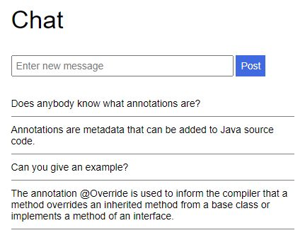
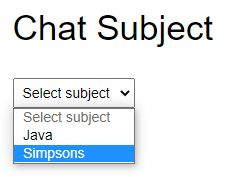
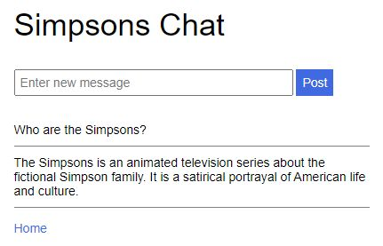
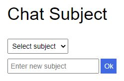

# BTI1301 Web Programming - Beispielprüfung

## Einführung

Dieses Repository enthält die Implementierung einer einfachen Chat-Applikation, mit welcher Benutzer Meldungen untereinander austauschen können.

  

Eine Meldung hat einen Identifier und einen Text und gehört zu einem Thema (Subject). Hauptziel der folgenden Aufgaben ist es, die Zugehörigkeit der Meldungen zu einem Thema sichtbar zu machen. Dazu soll einerseits die REST-Schnittstelle, andererseits die Single-Page-Applikation erweitert werden.

**Bemerkung:** Bei allen Aufgaben wird eine angemessene Fehlerbehandlung erwartet. Zudem wird Wert auf die Code-Qualität gelegt.

## REST-Schnittstelle

### Aufgabe 1: Abfrage von Meldungen zu einem Thema (6 Punkte)

- Ergänzen Sie den Service `ChatService` um die Methode `getMessages(subject)`, welche eine Liste aller Meldungen mit dem angegebenen Thema gehören.
- Passen Sie die `doGet`-Methode des Servlets `MessageServlet` so an, dass mit folgendem REST-Request die Chat-Meldungen zu einem bestimmten Thema abgefragt werden können:
  
  `GET /api/messages?subject={subject}`
    
  Wenn die Angabe des Themas fehlt oder leer ist, sollen alle Chat-Meldungen zurückgegeben werden.

### Aufgabe 2: Abfrage der Themen (6 Punkte)

- Ergänzen Sie den Service `ChatService` um die Methode `getSubjects()`, welche eine Liste der Themen aller Chat-Meldungen (ohne Duplikate) zurückgibt.
- Implementieren Sie ein zusätzliches Servlet `SubjectServlet`, welches erlaubt, mit folgendem REST-Request alle bestehenden Chat-Themen abzufragen:
  
  `GET /api/subjects`
  
  Die Themen sollen als JSON-Array von Strings zurückgegeben werden.

### Aufgabe 3: Löschen einer Meldung (8 Punkte)

- Ergänzen Sie den Service `ChatService` um eine Methode `removeMessage(id)`, welche die Meldung mit dem angegebenen Identifier entfernt.
- Erweitern Sie das Servlet `MessageServlet` so, dass eine Chat-Meldung mit folgendem REST-Request gelöscht werden kann:
  
  `DELETE /api/messages/{id}`
  
- Implementieren Sie einen Filter, sodass das Löschen von Meldungen nur Benutzern mit Username "admin" und Passwort "12345" erlaubt ist.

## Single-Page Application

### Aufgabe 4: Abfragen von Meldungen und Themen (2 Punkte)

- Passen Sie die Funktion `getMessages` des Moduls `service` so an, dass nur Meldungen eines bestimmten Themas vom Server abgefragt werden (siehe Aufgabe 1).
- Fügen Sie eine Funktion `getSubjects` hinzu, mit welcher alle Chat-Themen vom Server abgefragt werden können (siehe Aufgabe 2).

### Aufgabe 5: Auswahl eines Themas (8 Punkte)

- Implementieren Sie eine neue Komponente `home`, welche beim Starten der Applikation angezeigt wird:

  

    
  

  Die Komponente enthält eine Auswahlliste mit allen bestehenden Themen. Unmittelbar nach Auswahl eines Themas soll dieses im Applikations-Store gespeichert und die Chat-Komponente angezeigt werden.

### Aufgabe 6: Meldungen zum ausgewählten Thema (2 Punkte)

- Passen Sie die Chat-Komponente so an, dass nur Meldungen zum ausgewählten Thema angezeigt und neue Meldungen mit dem ausgewählten Thema zum Server geschickt werden.
- Ergänzen Sie im Titel das ausgewählte Thema und fügen Sie einen Link hinzu, welcher auf die Home-Komponente zurückführt.

  

    
  

### Aufgabe 7: Eingabe eines neuen Themas (4 Punkte)

- Ergänzen Sie die Home-Komponente um ein Eingabefeld, mit welchem ein neues Thema eingegeben werden kann:

  

    
  

  Nach dem Drücken des Ok-Knopfs wird das eingegebene Thema im Applikations-Store gespeichert und die Chat-Komponente angezeigt.

### Aufgabe 8: Automatisches Refresh (4 Punkte)

- Entfernen Sie den Refresh-Knopf aus der Chat-Komponente und starten Sie stattdessen einen Timer, welcher alle 10 Sekunden die Meldungen vom Server abfragt und anzeigt.
- Registrieren Sie auf dem Home-Link einen Event-Handler, welcher den Timer wieder stoppt.
